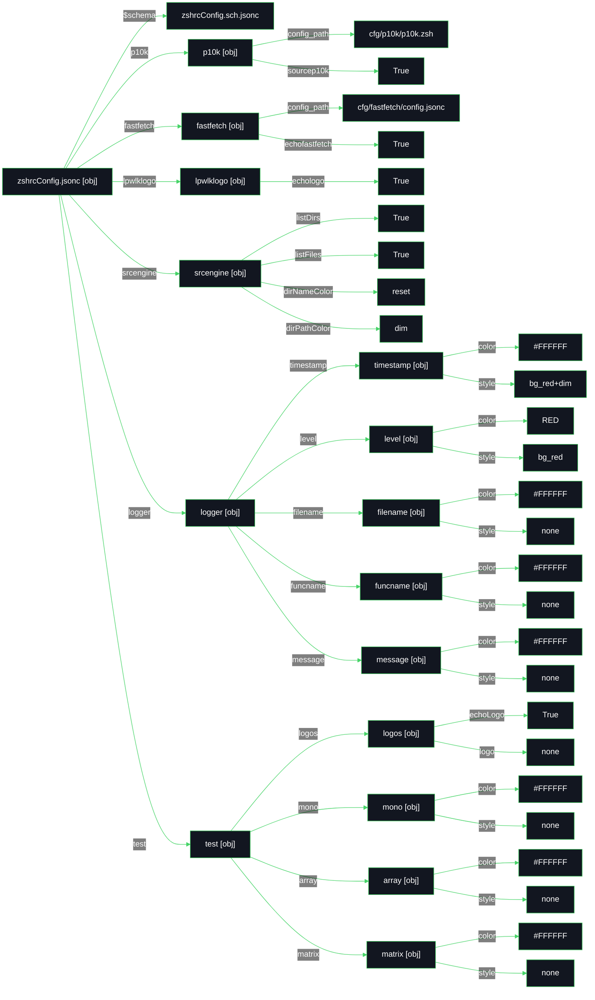

### zshrcConfig.jsonc

```mermaid
%%{init: {
        'theme':'base',
        'themeVariables': {
            'lineColor': '#47D468', 'mainBkg': '#121620',
            'clusterBkg': '#11161D', 'nodeBkg': '#000000', 
            'edgeLabelBackground': '#00000000',
            'nodeBorder': '#2fbb4f', 'clusterBorder': '#2fbb4f',
            'titleColor': '#ffffff', 'primaryTextColor': '#ffffff'
        },
        'flowchart': {
	    'subGraphTitleMargin': {'top': 5, 'bottom': 5},
        'rankSpacing': '40', 'nodeSpacing': '20',
	    'diagramPadding': '5', 'curve': 'basis'
        }
    }
}%%
graph LR
    n1["zshrcConfig.jsonc [obj]"]
    n2["zshrcConfig.sch.jsonc"]
    n3["p10k [obj]"]
    n4["cfg/p10k/p10k.zsh"]
    n5["True"]
    n6["fastfetch [obj]"]
    n7["cfg/fastfetch/config.jsonc"]
    n8["True"]
    n9["lpwlklogo [obj]"]
    n10["True"]
    n11["srcengine [obj]"]
    n12["True"]
    n13["True"]
    n14["reset"]
    n15["dim"]
    n16["logger [obj]"]
    n17["timestamp [obj]"]
    n18["#FFFFFF"]
    n19["bg_red+dim"]
    n20["level [obj]"]
    n21["RED"]
    n22["bg_red"]
    n23["filename [obj]"]
    n24["#FFFFFF"]
    n25["none"]
    n26["funcname [obj]"]
    n27["#FFFFFF"]
    n28["none"]
    n29["message [obj]"]
    n30["#FFFFFF"]
    n31["none"]
    n32["test [obj]"]
    n33["logos [obj]"]
    n34["True"]
    n35["none"]
    n36["mono [obj]"]
    n37["#FFFFFF"]
    n38["none"]
    n39["array [obj]"]
    n40["#FFFFFF"]
    n41["none"]
    n42["matrix [obj]"]
    n43["#FFFFFF"]
    n44["none"]
    n1 --> |"$schema"| n2
    n1 --> |"p10k"| n3
    n3 --> |"config_path"| n4
    n3 --> |"sourcep10k"| n5
    n1 --> |"fastfetch"| n6
    n6 --> |"config_path"| n7
    n6 --> |"echofastfetch"| n8
    n1 --> |"lpwlklogo"| n9
    n9 --> |"echologo"| n10
    n1 --> |"srcengine"| n11
    n11 --> |"listDirs"| n12
    n11 --> |"listFiles"| n13
    n11 --> |"dirNameColor"| n14
    n11 --> |"dirPathColor"| n15
    n1 --> |"logger"| n16
    n16 --> |"timestamp"| n17
    n17 --> |"color"| n18
    n17 --> |"style"| n19
    n16 --> |"level"| n20
    n20 --> |"color"| n21
    n20 --> |"style"| n22
    n16 --> |"filename"| n23
    n23 --> |"color"| n24
    n23 --> |"style"| n25
    n16 --> |"funcname"| n26
    n26 --> |"color"| n27
    n26 --> |"style"| n28
    n16 --> |"message"| n29
    n29 --> |"color"| n30
    n29 --> |"style"| n31
    n1 --> |"test"| n32
    n32 --> |"logos"| n33
    n33 --> |"echoLogo"| n34
    n33 --> |"logo"| n35
    n32 --> |"mono"| n36
    n36 --> |"color"| n37
    n36 --> |"style"| n38
    n32 --> |"array"| n39
    n39 --> |"color"| n40
    n39 --> |"style"| n41
    n32 --> |"matrix"| n42
    n42 --> |"color"| n43
    n42 --> |"style"| n44
```